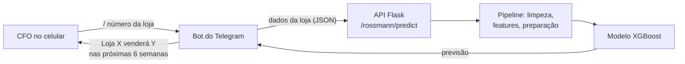

# Previsão de Vendas — Rede de Farmácias Rossmann

Modelo de machine learning que prevê as vendas das próximas 6 semanas de cada uma das 1.115 lojas da rede, publicado como API e consultável por um bot no Telegram.

## Problema de negócio

A Rossmann opera farmácias em vários países europeus. O CFO precisa definir o orçamento de reforma das lojas e quer basear essa decisão na receita que cada loja vai gerar nas próximas 6 semanas. Hoje, cada gerente faz sua própria previsão, sem método comum, e os resultados variam muito em qualidade.

**Objetivo:** prever as vendas diárias das próximas 6 semanas para cada loja e entregar o resultado de forma que o CFO consulte pelo celular, a qualquer momento.

## Resultados

| Modelo | MAE | MAPE | RMSE |
|---|---|---|---|
| Média por loja (baseline) | 1.354,80 | 45,5% | 1.835,14 |
| Regressão Linear | 1.867,09 | 29,3% | 2.671,05 |
| Lasso | 1.891,70 | 28,9% | 2.744,45 |
| Random Forest | 679,62 | 10,0% | 1.011,19 |
| **XGBoost (ajustado)** | **664,97** | **9,75%** | **957,77** |

- O XGBoost ajustado erra em média **9,75%**, contra **45,5%** da previsão por média histórica, que é o que a empresa conseguiria sem modelo.
- Na validação cruzada temporal (5 janelas), Random Forest e XGBoost ficaram em 12% ± 2% e 14% ± 2% de MAPE antes do ajuste de hiperparâmetros. O XGBoost foi escolhido por gerar um modelo bem menor e mais rápido para colocar em produção.
- **Previsão total para as 6 semanas:** 285,9 milhões em vendas, com cenário pessimista de 285,1 milhões e otimista de 286,6 milhões (moeda do dataset).
- O erro varia por loja: a maioria fica abaixo de 10%, mas algumas lojas têm MAPE acima de 50%. Elas foram sinalizadas como casos que pedem análise própria antes de decidir o orçamento.

## Estratégia da solução

1. **Descrição e limpeza dos dados:** tratamento de valores ausentes (distância e data de abertura de concorrentes, promoções contínuas).
2. **Mapa mental de hipóteses e feature engineering:** variáveis de tempo, de competição e de promoção.
3. **Análise exploratória:** validação de hipóteses de negócio, por exemplo se lojas com concorrentes mais próximos vendem menos.
4. **Preparação:** rescaling, encoding e transformação logarítmica da variável resposta.
5. **Seleção de variáveis** com Boruta.
6. **Modelagem** com validação cruzada temporal e ajuste de hiperparâmetros por busca aleatória.
7. **Tradução para negócio:** erro por loja, cenários otimista e pessimista e previsão total.
8. **Deploy:** API Flask com o modelo e o pipeline de preparação, e um bot no Telegram que consulta a API.

## Arquitetura de produção



## Estrutura

```
├── notebooks/rossmann_sales_forecast.ipynb   # ciclo completo: EDA, modelagem e resultados
├── img/                                      # mapa de hipóteses
├── rossmann/Rossmann.py                      # pipeline de preparação usado pela API
├── model/  parameter/                        # modelo treinado e scalers
├── handler.py                                # API Flask
└── telegram-bot/bot.py                       # bot do Telegram
```

## Como rodar

```bash
pip install -r requirements.txt
python handler.py          # API em http://localhost:5000/rossmann/predict
```

Bot do Telegram (precisa de um token criado no @BotFather):

```bash
cd telegram-bot
export TELEGRAM_TOKEN=seu_token
export API_URL=http://localhost:5000/rossmann/predict
python bot.py
```

**Dados:** [Rossmann Store Sales — Kaggle](https://www.kaggle.com/c/rossmann-store-sales/data). Baixe `train.csv`, `test.csv` e `store.csv` para a pasta `data/`.

## Próximos passos

- Modelos específicos para as lojas com erro acima de 30%.
- Incluir variáveis externas, como feriados regionais e clima.
- Retreino automático e monitoramento do erro em produção.

## Tecnologias

Python · pandas · scikit-learn · XGBoost · Boruta · Flask · Telegram Bot API

---

Projeto desenvolvido na Formação Cientista de Dados da Comunidade DS.
